# The LLM Report — Master NLSpec

## Document Purpose

This is a natural language specification (nlspec) for building **The LLM Report** (theLLMreport.com), an autonomous AI news intelligence pipeline using the Software Factory methodology. Feed this document and its companion scenario holdout file into a coding agent (Claude Code, Codex, or equivalent) to generate the implementation.

**Build instruction:**
```
codeagent> Implement The LLM Report as described in this nlspec. Do not deviate from the specified architecture. Build iteratively: implement each pipeline stage, run the scenario holdouts, and converge before moving to the next stage.
```

---

## 1. System Overview

### 1.1 What This System Does

**The LLM Report** is an automated news intelligence pipeline that monitors the AI industry — specifically model releases, patches, updates, agent frameworks, and software factory methodologies — and produces polished, journalist-quality newsletters and website content published at theLLMreport.com on a 3-day-per-week schedule (Monday, Wednesday, Friday).

### 1.2 Design Philosophy

This system is built following the StrongDM Software Factory methodology:
- **Code must not be written by humans.** The coding agent implements everything from these specs.
- **Code must not be reviewed by humans.** Quality is ensured through scenario holdout testing, not code review.
- **Specs are the source of truth.** This document defines _what_ the system does. The coding agent decides _how_.
- **Scenarios are the evaluation.** Companion scenario files (stored outside the codebase) validate that the system works.

### 1.3 Core Principles

1. **Factual over opinion.** Content reads like Reuters or Ars Technica, not a blog. Claims are sourced. Speculation is labeled as analysis and attributed.
2. **Copyright compliant.** All content is original paraphrase. No reproduced paragraphs, no quoted passages over 14 words, no reproduced lyrics/poems/code blocks from sources. Every claim is attributed.
3. **Cost-aware.** Every LLM call is budgeted, tracked, and routable to the cheapest sufficient model. Hard daily spend caps are enforced at the proxy layer.
4. **Local-first knowledge.** A local knowledge base (vector DB + structured store) is the first source of truth. LLM calls happen only when local context is insufficient.
5. **Journalist voice.** The final output reads as though written by an experienced human technology journalist. Dry, precise, well-structured. Thought leadership commentary is clearly demarcated and labeled as "Analysis" or "Industry Outlook."

---

## 2. Pipeline Architecture

### 2.1 Pipeline Graph (DOT Definition)

```dot
digraph ai_news_pipeline {
    rankdir=LR;
    node [shape=box, style=rounded];

    // --- Stage 1: Collection ---
    collect [label="Collector\n(scrape + ingest)"];
    kb_store [label="Knowledge Base\n(store raw)"];

    // --- Stage 2: Triage ---
    triage [label="Triage Agent\n(score + classify + promote)"];

    // --- Stage 3: Analysis ---
    dedup [label="Deduplication\n(cluster stories)"];
    analyze [label="Analysis Agent\n(synthesize + verify)"];
    kb_query [label="KB Query\n(retrieve context)"];

    // --- Stage 4: Editorial ---
    editorial [label="Editorial Agent\n(rewrite + polish)"];
    compliance [label="Compliance Check\n(copyright + attribution)"];

    // --- Stage 5: Publishing ---
    website [label="Website Publisher\n(markdown → git)"];
    newsletter [label="Newsletter Publisher\n(Buttondown API)"];
    subscriber_mgmt [label="Subscriber Mgmt\n(tags + segments)"];

    // --- Edges ---
    collect -> kb_store;
    kb_store -> triage;
    triage -> dedup [label="significance >= threshold"];
    triage -> kb_store [label="low significance\n(archive only)", style=dashed];
    dedup -> analyze;
    analyze -> kb_query [label="need context", style=dashed];
    kb_query -> analyze [label="context retrieved", style=dashed];
    analyze -> editorial;
    editorial -> compliance;
    compliance -> editorial [label="failed\n(rewrite)", style=dashed, color=red];
    compliance -> website [label="passed"];
    compliance -> newsletter [label="passed"];
    newsletter -> subscriber_mgmt;

    // --- Breaking news express path ---
    collect -> triage [label="breaking\n(significance=critical)"];
    triage -> analyze [label="express path\n(skip dedup)"];

    // --- Subgraph: Local Knowledge Base ---
    subgraph cluster_kb {
        label="Local Knowledge Base";
        style=filled;
        color=lightgrey;
        kb_vector [label="Vector Store\n(ChromaDB/SQLite)"];
        kb_structured [label="Structured Store\n(SQLite)"];
        kb_cache [label="Semantic Cache\n(recent queries)"];
    }

    kb_store -> kb_vector;
    kb_store -> kb_structured;
    kb_query -> kb_vector;
    kb_query -> kb_structured;
    kb_query -> kb_cache;

    // --- Subgraph: Cost Control ---
    subgraph cluster_cost {
        label="Cost Control Layer";
        style=filled;
        color=lightyellow;
        litellm [label="LiteLLM Proxy\n(routing + budget)"];
        cost_tracker [label="Cost Tracker\n(per-run + per-stage)"];
        budget_enforcer [label="Budget Enforcer\n(hard caps + alerts)"];
    }

    litellm -> cost_tracker;
    cost_tracker -> budget_enforcer;
}
```



### 2.2 Runtime Model

**Schedule:** Monday, Wednesday, Friday.

- **Batch run:** Triggered at 05:00 UTC on scheduled days. Traverses the full pipeline: Collect → Triage → Dedup → Analyze → Editorial → Compliance → Publish.
- **Breaking news (Phase 2):** Lightweight RSS/webhook listener runs continuously. When a Tier 1 source publishes content matching high-signal patterns (new model release, major acquisition, critical security incident), it triggers an express pipeline: collect the single source → triage (auto-classified as critical) → analyze → editorial → compliance → publish as "Breaking" update. Optional: push notification to newsletter subscribers who opted into alerts.

**Phase 1 (MVP):** Batch only. No event-driven triggers.
**Phase 2 (post-validation):** Add event-driven express path.

---

## 3. Source Configuration

### 3.1 Source Tiers

Sources are organized by tier. Tier determines polling frequency, coverage depth, and promotion behavior.

**Tier 1 — Every Run, Full Coverage:**
| Source | Type | URL/Feed |
|--------|------|----------|
| OpenAI Blog | RSS/Web | https://openai.com/blog |
| OpenAI API Changelog | Web | https://platform.openai.com/docs/changelog |
| Anthropic Blog/News | RSS/Web | https://www.anthropic.com/news |
| Anthropic API Changelog | Web | https://docs.anthropic.com/en/docs/about-claude/models |
| Google DeepMind Blog | RSS/Web | https://deepmind.google/discover/blog/ |
| Google AI/Gemini Updates | Web | https://blog.google/technology/ai/ |

**Tier 2 — Every Run, Standard Coverage:**
| Source | Type | URL/Feed |
|--------|------|----------|
| DeepSeek Blog/GitHub | Web/API | https://github.com/deepseek-ai |
| Meta AI / Llama | Web/GitHub | https://ai.meta.com/blog/ , https://github.com/meta-llama |
| StrongDM Factory | Web/GitHub | https://factory.strongdm.ai , https://github.com/strongdm |
| OpenClaw | Web/GitHub | https://github.com/openclaw/openclaw |

**Tier 3 — Weekly Roundup (Friday runs only):**
| Source | Type | URL/Feed |
|--------|------|----------|
| Mistral AI | Web/GitHub | https://mistral.ai/news/ |
| Qwen / Alibaba Cloud | GitHub | https://github.com/QwenLM |
| Hugging Face Trending | API | https://huggingface.co/models?sort=trending |
| arXiv cs.AI (high-signal) | API | https://arxiv.org/list/cs.AI/recent |
| Simon Willison's Weblog | RSS | https://simonwillison.net/atom/everything/ |
| LLM Stats News | Web | https://llm-stats.com/ai-news |

### 3.2 Tier Promotion Rule

If the Triage Agent scores a Tier 2 or Tier 3 story with significance >= 8/10, that story is **promoted** to receive Tier 1 depth coverage in the current run. This handles the "major news from a lower-tier model" case. Example: if DeepSeek releases a model that benchmarks above GPT-5, it gets full Tier 1 treatment for that run.

### 3.3 Source Schema

Each collected item is stored as:
```
CollectedItem:
    id: UUID
    source_name: String              # "OpenAI Blog"
    source_tier: Int (1-3)
    url: String                      # canonical URL
    title: String
    raw_content: String              # full text or significant excerpt
    published_at: DateTime
    collected_at: DateTime
    content_hash: String             # SHA-256 of raw_content (dedup key)
    tags: List<String>               # auto-extracted: ["model-release", "gpt-5", "openai"]
    significance_score: Float | None # assigned by Triage Agent
    promoted: Boolean                # true if tier-promoted for this run
```

---

## 4. Local Knowledge Base

### 4.1 Purpose

The knowledge base exists to **reduce LLM token usage** by providing context locally. Before any LLM call that requires historical context (e.g., "how does this compare to the previous release?"), the pipeline queries the KB first and injects the results as context. This avoids re-explaining background information that the system already knows.

### 4.2 Components

**A. Vector Store (ChromaDB with SQLite backend)**
- Stores embeddings of all previously collected items and all previously published articles.
- Used for: semantic deduplication, "related stories" retrieval, context injection for analysis.
- Embedding model: A small, fast, local embedding model (e.g., `all-MiniLM-L6-v2` via sentence-transformers). Runs locally, zero API cost.
- Chunking: 512 tokens per chunk with 50-token overlap.

**B. Structured Store (SQLite)**
- Tables:
  - `models`: Known models with metadata (name, provider, release_date, parameter_count, context_window, key_benchmarks, pricing, status).
  - `organizations`: Tracked organizations (name, type, key_people, recent_events).
  - `published_articles`: All previously published content (title, date, topics, content_hash).
  - `source_items`: All collected items (see CollectedItem schema above).
  - `run_log`: Pipeline run metadata (run_id, date, total_cost, items_collected, items_published, errors).
  - `cost_log`: Per-call cost tracking (run_id, stage, model_used, input_tokens, output_tokens, cost_usd, timestamp).

**C. Semantic Cache (SQLite + embeddings)**
- Caches recent LLM query-response pairs with their embeddings.
- Before making an LLM call, check if a semantically similar query was answered in the last 7 days.
- Similarity threshold: 0.92 cosine similarity.
- Cache TTL: 7 days for factual queries, 1 day for news-dependent queries.

### 4.3 KB-First Query Pattern

Every pipeline stage that needs context follows this pattern:
1. Formulate the query.
2. Check semantic cache. If hit (>= 0.92 similarity, within TTL), use cached response. **Cost: $0.**
3. Query vector store for relevant chunks. Retrieve top-5 chunks.
4. Query structured store for entity metadata (model specs, org info, etc.).
5. Assemble local context from steps 2-4.
6. If local context is sufficient to answer the query: use it directly. **Cost: $0.**
7. If local context is insufficient: make an LLM call with the local context injected as grounding. This reduces the prompt the LLM needs to process and grounds its response. **Cost: reduced vs. no-context call.**
8. Cache the LLM response for future use.

### 4.4 KB Maintenance

After each pipeline run:
- New collected items are embedded and stored in the vector store.
- New model/org metadata is upserted into the structured store.
- Published articles are embedded and stored.
- Stale cache entries (> TTL) are purged.
- Run costs are logged.

---

## 5. Stage Specifications

### 5.1 Stage: Collector

**Purpose:** Fetch new content from configured sources.

**Model tier:** Cheap (Haiku-class or GPT-4o-mini). Most collection is structured scraping, not LLM reasoning.

**Behavior:**
1. For each source in the active tier list (Tier 1 + Tier 2 on all runs; add Tier 3 on Friday):
   a. Fetch the source (RSS parse, web scrape, GitHub API).
   b. Extract: title, content, publish date, URL.
   c. Compute content_hash.
   d. Check KB structured store: if content_hash already exists, skip.
   e. Auto-tag using a lightweight LLM call (or regex/keyword matching for common patterns like "model release", "security patch", "partnership").
   f. Store as CollectedItem in KB.
2. Output: list of new CollectedItems for this run.

**Cost optimization:**
- Use regex/keyword tagging before LLM tagging. Only call the LLM for items where automated tagging is ambiguous.
- RSS feeds are preferred over web scraping — less processing, more structured.
- GitHub API calls use conditional requests (If-Modified-Since) to avoid re-fetching unchanged data.

### 5.2 Stage: Triage Agent

**Purpose:** Score each new item for significance and classify it.

**Model tier:** Mid-range (Sonnet-class or GPT-4o). Needs good judgment but not deep reasoning.

**Behavior:**
1. For each new CollectedItem:
   a. Query KB for related previous items (vector similarity search, top-3).
   b. Score significance on 1-10 scale based on:
      - Novelty: Is this genuinely new, or an incremental update?
      - Impact: Does this affect how practitioners build or deploy AI?
      - Breadth: Does this affect one product or the whole industry?
      - Timeliness: Is this breaking, or background context?
   c. Classify into content categories: `model-release`, `api-update`, `security-patch`, `acquisition`, `partnership`, `research-paper`, `framework-release`, `methodology`, `policy-regulatory`, `benchmark`, `pricing-change`.
   d. Apply tier promotion rule: if significance >= 8 AND source is Tier 2 or Tier 3, set `promoted = true`.
2. Items with significance < 4: archive only (stored in KB but not passed downstream).
3. Items with significance 4-6: included in weekly roundup section.
4. Items with significance 7+: included as individual stories.
5. Items with significance 9-10: flagged as potential lead story.

**Prompt template (injected by pipeline, not hardcoded):**
```
You are a senior technology news editor assessing incoming stories for an AI industry newsletter.

CONTEXT FROM KNOWLEDGE BASE:
{kb_context}

NEW ITEM TO ASSESS:
Title: {title}
Source: {source_name} (Tier {source_tier})
Published: {published_at}
Content: {raw_content}

Score this item 1-10 for significance and classify it.
Return JSON: {"significance": N, "category": "...", "rationale": "one sentence", "suggested_headline": "...", "promoted": true/false}
```

### 5.3 Stage: Deduplication

**Purpose:** Cluster items that cover the same story from different sources.

**Model tier:** Cheap or local-only. Primarily vector similarity, minimal LLM usage.

**Behavior:**
1. Take all items passing triage (significance >= 4).
2. Compute pairwise cosine similarity using KB vector embeddings.
3. Cluster items with similarity >= 0.85 into story groups.
4. For each cluster: designate the highest-significance item as the primary, others as supporting sources.
5. Output: list of StoryGroups, each containing a primary item and supporting items.

**Cost optimization:** This stage should use zero or near-zero LLM calls. Vector similarity is computed locally.

### 5.4 Stage: Analysis Agent

**Purpose:** Synthesize each story group into a factual, multi-source brief with verified claims.

**Model tier:** Strong (Opus-class, Sonnet 4.5, or GPT-5.2). This is the highest-quality stage.

**Behavior:**
1. For each StoryGroup:
   a. Query KB for historical context:
      - Previous related stories (vector search).
      - Entity metadata (model specs, org info from structured store).
      - Relevant previously published articles (to avoid repeating old analysis).
   b. Synthesize a structured brief:
      - **What happened:** Factual summary, multi-source where available.
      - **Why it matters:** Significance in context of the broader AI landscape.
      - **Key details:** Specs, benchmarks, pricing, availability.
      - **Sources:** List of all sources with URLs.
   c. Cross-reference claims: if a claim appears in only one source, flag it as "single-source" with lower confidence.
   d. Identify potential "Analysis" angles — forward-looking implications, industry trend connections. These are clearly labeled as analysis, not fact.

2. For promoted Tier 2/3 stories: include additional competitive context (how does this compare to Tier 1 equivalents?).

3. Output: list of AnalyzedStories, each containing the structured brief, source list, confidence ratings, and optional analysis angles.

**Cost optimization:**
- KB context injection reduces the amount of "background" the LLM needs to generate.
- Prompt caching: the system prompt + editorial guidelines are identical across all stories in a run. Use Anthropic's cache_control or equivalent to cache this prefix. Saves ~90% on repeated system prompt tokens.
- Batch: if the LLM provider supports batch API (non-real-time), use it for a 50% cost reduction on this stage.

### 5.5 Stage: Editorial Agent

**Purpose:** Transform analyzed briefs into polished, journalist-quality prose.

**Model tier:** Strong (Opus-class or Sonnet 4.5). Writing quality is paramount.

**Behavior:**
1. For each AnalyzedStory, produce a publication-ready article:
   a. **Voice and tone:** Experienced technology journalist. Reuters/Ars Technica register. Third person. Present tense for current state, past tense for events. No first person. No "we." No promotional language. No emoji.
   b. **Structure:**
      - Headline (clear, factual, no clickbait, max 80 characters).
      - Subheadline (one sentence providing additional context).
      - Lead paragraph (who, what, when, where — the core news in 2-3 sentences).
      - Body (details, context, comparisons — written in flowing paragraphs, NOT bullet points).
      - Analysis section (clearly demarcated with "**Analysis:**" header, only when the Triage Agent flagged significance >= 7 AND the Analysis Agent identified a forward-looking angle). This section may include measured speculation about industry direction, competitive implications, or technical trajectory — always attributed as editorial perspective, never presented as fact.
      - Sources footer (list of source URLs).
   c. **Length:** 300-600 words for standard stories. 600-1000 words for lead stories (significance >= 9). 100-200 words for roundup items.
   d. **Attribution:** Every factual claim cites its source inline ("according to OpenAI's blog post," "as reported by TechCrunch," etc.).
   e. **Copyright compliance:**
      - All content is original paraphrase.
      - Zero direct quotes over 14 words from any single source.
      - Maximum one short direct quote per source (under 14 words), only when the exact wording carries legal or technical significance (e.g., a CEO's stated commitment).
      - No reproduced code blocks, lyrics, poems, or article paragraphs.
      - No reconstruction of an article's structure or narrative flow.
   f. **Thought leadership:** The Analysis section is the ONLY place for forward-looking commentary. It must be:
      - Clearly labeled.
      - Grounded in factual context from the brief.
      - Measured in tone (avoid superlatives, avoid predictions without qualification).
      - Useful — it should help the reader understand implications, not just restate the news.

2. Assemble the full newsletter edition for The LLM Report:
   a. Opening: 2-3 sentence overview of this edition's key themes. Tone: confident, direct, no throat-clearing.
   b. Lead story (highest significance).
   c. Individual stories (significance 7+), ordered by significance descending.
   d. Weekly roundup section (significance 4-6), formatted as short paragraphs with source links.
   e. "Industry Outlook" section (optional, only if multiple stories in this run converge on a theme — e.g., "three separate providers cut pricing this week"). This is clearly labeled as editorial analysis.
   f. Closing: one-sentence sign-off. Example: "That's The LLM Report for [date]. See you [next day]." No calls to action beyond the implicit newsletter subscription. No "stay tuned."

### 5.6 Stage: Compliance Check

**Purpose:** Automated verification that content meets legal and ethical standards before publishing.

**Model tier:** Mid-range (Sonnet-class). Needs careful reading but not creative generation.

**Behavior:**
1. For each article, verify:
   a. **No direct quotes over 14 words** from any single source.
   b. **No more than one direct quote per source.**
   c. **Every factual claim has inline attribution.**
   d. **No unattributed speculation** outside clearly labeled Analysis sections.
   e. **No promotional language** that could be construed as endorsement.
   f. **No reproduction of copyrighted structure** (article outlines, section headers mirroring a source).
   g. **All source URLs are valid** (HEAD request check).
   h. **Tone check:** does this read like a journalist wrote it, or like an AI summary?
2. If any check fails: return the article to the Editorial Agent with specific failure reasons and the failing text highlighted. The Editorial Agent rewrites the flagged sections.
3. Maximum 3 compliance loops per article. If still failing after 3 rewrites, flag for human review and exclude from this run.

### 5.7 Stage: Website Publisher

**Purpose:** Publish approved content to theLLMreport.com.

**Model tier:** None (deterministic operations only).

**Behavior:**
1. Convert the final newsletter content to Markdown (or MDX) with Astro-compatible front matter.
2. Generate front matter: title (e.g., "The LLM Report — February 20, 2026"), date, tags, description (auto-generated summary for SEO), author ("The LLM Report").
3. Write the edition file to `website/src/content/editions/YYYY-MM-DD.md`.
4. Write individual lead story articles to `website/src/content/articles/slug.md`.
5. Commit all new content files to the website git repository.
6. Push to the `main` branch on GitHub — this triggers automatic deployment.
7. Wait 60 seconds for deployment, then verify by fetching the new edition URL and checking for HTTP 200.
8. Update the site's RSS feed (auto-generated by Astro from content collection).
9. Log the publication in KB structured store (`published_articles` table).
10. If deployment verification fails: log the error, retry once after 120 seconds. If still failing, log a deployment failure but continue to newsletter publishing (newsletter does not depend on site being live).

### 5.8 Stage: Newsletter Publisher

**Purpose:** Distribute The LLM Report newsletter to subscribers.

**Model tier:** None for sending. Cheap model for subscriber management.

**Behavior:**
1. Format the newsletter for email delivery:
   a. HTML email template, responsive, clean typography matching the website design system.
   b. Header: "The LLM Report" with edition date and tagline.
   c. Footer: physical mailing address (CAN-SPAM), unsubscribe link, "Powered by The LLM Report — AI industry intelligence, sourced and verified."
   d. Content matches what's published on theLLMreport.com, with links back to the website for full article pages.
2. Push to Buttondown API as a draft (Phase 1) or direct send (Phase 2, after trust is established).
3. Subscriber management:
   a. Welcome flow: new subscriber gets a confirmation email (handled by Buttondown's built-in flow). Welcome email subject: "Welcome to The LLM Report."
   b. Segment tagging: based on subscriber click behavior, tag interests (e.g., "openai-focused", "open-source-focused", "agent-frameworks"). Use Buttondown's tagging API. This runs post-send based on analytics data.
   c. Unsubscribe/GDPR: handled entirely by Buttondown's compliance infrastructure. The pipeline does NOT build custom unsubscribe logic.

---

## 6. Model Routing and Cost Control

### 6.1 LiteLLM Proxy Configuration

All LLM calls route through a LiteLLM proxy. No direct API calls from pipeline code.

**Model assignments by stage:**

| Stage | Default Model | Reasoning | Estimated Cost/Run |
|-------|--------------|-----------|-------------------|
| Collector (tagging) | claude-haiku-4-5 / gpt-4o-mini | Structured extraction, low complexity | $0.10-0.30 |
| Triage | claude-sonnet-4-5 / gpt-4o | Judgment + classification | $0.50-1.00 |
| Deduplication | Local only (vector similarity) | No LLM needed | $0.00 |
| Analysis | claude-sonnet-4-5 / claude-opus-4-5 | Deep synthesis, highest quality needed | $1.00-3.00 |
| Editorial | claude-sonnet-4-5 / claude-opus-4-5 | Writing quality paramount | $1.00-3.00 |
| Compliance | claude-sonnet-4-5 / gpt-4o | Careful verification | $0.30-0.80 |
| Publishing | None | Deterministic | $0.00 |
| **Total per run** | | | **$2.90-8.10** |
| **Monthly (12 runs)** | | | **$35-97** |

### 6.2 Budget Enforcement

**Hard caps (enforced by LiteLLM):**
- Per-run: $15 maximum. If hit, pipeline completes current stage and stops. Publishes what's ready.
- Per-day: $20 maximum. Prevents runaway retries.
- Per-month: $200 maximum. Safety net.

**Alert thresholds:**
- 50% of per-run budget: log warning.
- 80% of per-run budget: log alert, notify operator.
- 100%: hard stop, publish what's ready, notify operator.
- Anomaly: if current run cost > 2x the 12-run rolling average, pause and notify before publishing.

### 6.3 Cost Tracking Schema

Every LLM call logs:
```
CostEntry:
    run_id: String
    stage: String               # "collector", "triage", "analysis", etc.
    model_used: String          # actual model string
    provider: String            # "anthropic", "openai", "local"
    input_tokens: Int
    output_tokens: Int
    cached_tokens: Int          # prompt cache hits
    cost_usd: Float
    timestamp: DateTime
    cache_hit: Boolean          # semantic cache hit (no LLM call)
    kb_context_tokens: Int      # tokens injected from KB (saves context)
```

### 6.4 Cost Optimization Strategies (Priority Order)

1. **Semantic cache** — if a similar query was answered recently, reuse it. Target: 10-20% of calls avoided.
2. **KB context injection** — ground LLM calls with local context so they produce shorter, more focused responses. Target: 30-50% reduction in output tokens.
3. **Prompt caching** — use Anthropic's cache_control on system prompts and editorial guidelines (identical across all calls in a run). Target: 90% reduction on cached prefix tokens.
4. **Tiered model routing** — cheap models for simple tasks, strong models only where quality matters.
5. **Local-only stages** — deduplication and publishing use zero API tokens.
6. **Batch API** — for non-time-sensitive stages (analysis, editorial), use batch endpoints where available for 50% cost reduction.
7. **Three-day schedule** — 12 runs/month instead of 30 reduces baseline cost by 60%.

---

## 7. Website Specification

### 7.1 Brand Identity

- **Name:** The LLM Report
- **Domain:** theLLMreport.com
- **Tagline:** "AI industry intelligence, sourced and verified." (or similar — the Editorial Agent may refine this during build, logged in FACTORY_LOG.md)
- **Voice:** Authoritative, factual, concise. Think Stratechery meets Reuters tech desk.
- **Disclosure:** Every page and newsletter clearly states this is AI-generated content verified against multiple sources.

### 7.2 Technology

Static site generator: **Astro** (fast, Markdown-native, excellent RSS support, deploys to Vercel/Netlify/Cloudflare Pages).

The website MUST be built as part of the autonomous pipeline build (Milestone 5). The coding agent:
1. Scaffolds the Astro project in `/workspace/website/`.
2. Creates all page templates, layouts, and components.
3. Implements the design system (typography, colors, spacing).
4. Generates a sample edition using mock data to validate rendering.
5. Configures the build pipeline (`astro build` → static output).
6. Initializes a git repo, commits, and pushes to the website's GitHub repository.
7. Configures deployment (Vercel/Netlify) via the repo's deployment settings or a `vercel.json`/`netlify.toml` file.
8. Validates the deployed site loads correctly (via `curl` or `WebFetch` on the deployment URL).

### 7.3 Pages

- **Home (/):** Latest edition displayed in full, with a persistent header showing "The LLM Report" branding and navigation. Below the current edition, links to the 5 most recent previous editions.
- **Archive (/archive):** Chronological list of all published editions with titles, dates, and brief descriptions.
- **Article pages (/editions/YYYY-MM-DD and /articles/slug):** Individual edition pages and standalone article pages for lead stories. These are important for SEO, social sharing, and deep linking.
- **About (/about):** Description of the pipeline, transparency about AI-generated content. Explicit disclosure: "The LLM Report is produced by an AI-powered editorial pipeline. All content is fact-checked against multiple sources and verified for accuracy before publication. Analysis sections reflect pattern-based observations informed by industry data, not human opinions. We are committed to transparency about our methodology."
- **Newsletter signup (/subscribe):** Dedicated signup page with email capture form powered by Buttondown embed. Also include a signup component in the site header/footer on every page.
- **RSS feed (/rss.xml):** Full-content RSS feed for subscribers and aggregators.
- **JSON feed (/feed.json):** Machine-readable feed for programmatic consumers.

### 7.4 Design

Clean, minimal, fast-loading. High-contrast, typography-first design.

**Design references:** Stratechery, The Pragmatic Engineer, Simon Willison's Weblog, Ben Thompson's newsletter layouts.

**Design requirements:**
- Mobile-first responsive design.
- System font stack (no external font loading for speed): `-apple-system, BlinkMacSystemFont, 'Segoe UI', Roboto, 'Helvetica Neue', Arial, sans-serif`.
- Maximum content width: 680px (optimal reading width).
- Generous line height (1.6-1.8 for body text).
- Clear visual hierarchy: headline → subheadline → body → analysis callout → sources.
- Analysis sections visually distinct (left border, subtle background tint, labeled "Analysis").
- Dark mode support via `prefers-color-scheme` media query.
- No ads. No tracking scripts. Privacy-respecting analytics only (Plausible embed or equivalent, can be added later).
- Page load target: < 1 second on 3G. Lighthouse performance score > 95.
- Proper Open Graph and Twitter Card meta tags for social sharing (auto-generated per article).
- Structured data (JSON-LD) for Google News and search engine article indexing.

### 7.5 Deployment Configuration

The website repo should include deployment configuration for at least one platform. The coding agent should create:

**For Vercel:**
```json
// vercel.json (if Vercel is chosen)
{
  "buildCommand": "astro build",
  "outputDirectory": "dist",
  "framework": "astro"
}
```

**For Netlify:**
```toml
# netlify.toml (if Netlify is chosen)
[build]
  command = "astro build"
  publish = "dist"
```

**For Cloudflare Pages:**
The coding agent should configure via `wrangler.toml` or rely on Cloudflare's auto-detection of Astro projects.

The choice of platform is left to the coding agent based on whichever has the simplest zero-config deployment for Astro. The important thing is that `git push` to the website repo triggers an automatic build and deployment with no human intervention.

### 7.6 Publishing Workflow

When the pipeline publishes an edition:
1. The pipeline generates Markdown files with front matter (title, date, tags, description, author).
2. Files are written to the website repo's `src/content/editions/` directory.
3. The pipeline commits and pushes to the `main` branch.
4. The hosting platform auto-deploys.
5. The pipeline verifies deployment by fetching the new page URL and checking for a 200 response.
6. If verification fails, the pipeline logs the error and retries once. If still failing, it logs a deployment failure but does NOT block the newsletter send (the newsletter contains the content directly and doesn't depend on the website being live).

### 7.7 Website Content During Build Phase

The coding agent should create initial placeholder content during the build:
- A "Coming Soon" homepage with newsletter signup form.
- A sample edition generated from mock source data, demonstrating the full layout.
- An About page with the methodology description.
- Proper 404 page.
- Favicon and basic branding (simple typographic logo — "The LLM Report" in the heading font, no image logo needed initially).

---

## 8. Ethical and Legal Guardrails

### 8.1 Transparency

- Every published piece includes a footer: "The LLM Report — AI industry intelligence, sourced and verified. Published [date]. Report errors to [contact]."
- AI-generated content is never presented as human-written. The About page and every newsletter footer disclose the methodology.
- The About page explains the methodology in full.

### 8.2 Copyright

- Zero tolerance for reproduced copyrighted material (see Compliance Check stage).
- All content is original paraphrase with attribution.
- Source URLs are always linked — the pipeline drives traffic to original sources, not away from them.

### 8.3 Accuracy

- Claims require at least one source. Single-source claims are labeled as such.
- Analysis/speculation is always clearly demarcated and never presented as fact.
- If the pipeline cannot verify a claim from its sources, it omits it rather than including it with a caveat.

### 8.4 CAN-SPAM / GDPR Compliance

- Newsletter includes physical mailing address (required by CAN-SPAM).
- Unsubscribe link in every email (handled by Buttondown).
- No sharing of subscriber data with third parties.
- Data deletion requests honored within 30 days (handled by Buttondown's GDPR tools).
- No pre-checked consent boxes. Double opt-in for newsletter signup.

---

## 9. Security

### 9.1 Repository Security

All GitHub repositories (pipeline code and website source) MUST be **private**. Access is restricted to the repository owner and the factory's deploy key. No public-facing code.

**Access control:**
- Both repos created as **private** repositories on GitHub.
- Factory access via **deploy keys** (SSH, write access) — NOT personal access tokens.
- Deploy keys are scoped to a single repository each (one key per repo, or one key added to both).
- No GitHub Actions secrets, no third-party CI/CD integrations beyond the hosting platform.
- The hosting platform (Vercel/Netlify/Cloudflare Pages) connects to the private repo using its own OAuth integration — this works natively with private repos on personal accounts.
- No collaborators added unless explicitly granted by the owner.

**Hosting platform requirements:**
- Vercel: personal account (Hobby plan) can deploy from private repos on personal GitHub accounts. This is the recommended path.
- Netlify: supports private repos via OAuth connection during site setup.
- Cloudflare Pages: supports private repos via GitHub integration.

### 9.2 Website Security

**HTTPS (mandatory):**
- All hosting platforms (Vercel, Netlify, Cloudflare Pages) provide automatic HTTPS with free SSL certificates via Let's Encrypt or Cloudflare.
- HTTPS is enforced by default — no configuration needed.
- HTTP → HTTPS redirect is automatic.
- After custom domain (theLLMreport.com) is connected, SSL certificate is auto-provisioned.
- The coding agent should verify HTTPS is working as part of deployment validation (check for `https://` in response headers).

**Security headers (implement in Astro middleware or hosting config):**
```
Strict-Transport-Security: max-age=31536000; includeSubDomains; preload
X-Content-Type-Options: nosniff
X-Frame-Options: DENY
Referrer-Policy: strict-origin-when-cross-origin
Permissions-Policy: camera=(), microphone=(), geolocation=()
Content-Security-Policy: default-src 'self'; script-src 'self' 'unsafe-inline'; style-src 'self' 'unsafe-inline'; img-src 'self' data: https:; connect-src 'self' https://api.buttondown.com; frame-src 'none'
```

**Source code protection:**
- Integrate the `astro-obfuscator` package to obfuscate all client-side JavaScript during the Astro build step. This transforms readable JS into scrambled, functionally equivalent code.
- Minify and bundle all CSS and JS (Astro does this by default with Vite).
- Remove all HTML comments and source maps from production builds (`vite.build.sourcemap: false`).
- Disable directory listing (handled by hosting platform defaults).
- No inline comments in production HTML.
- Add a `robots.txt` that allows search engine crawling of content pages but blocks access to any API endpoints, admin routes, or non-content paths.

**Important realism note:** A static site's HTML/CSS is inherently inspectable — browsers need to render it. Obfuscation raises the bar significantly but is not absolute protection. The real security priority is: private repos (source code never exposed), HTTPS (data in transit encrypted), security headers (browser-level protections), and no secrets in client-side code (all API keys live server-side in the pipeline, never in the website).

### 9.3 Pipeline Security

- All API keys stored as environment variables, never in code or config files committed to git.
- `.env` file is in `.gitignore` and never committed.
- SSH keys have restrictive permissions (`chmod 600`).
- The Docker container runs with network restrictions — only allowed domains can be reached (see deployment section).
- LiteLLM proxy runs locally in the same container/VPS — API keys never traverse the public internet except to provider endpoints.
- Pipeline logs may contain source URLs and content snippets but NEVER contain API keys, subscriber emails, or authentication tokens.

### 9.4 Subscriber Data Security

- Subscriber data lives exclusively in Buttondown's infrastructure — the pipeline never stores subscriber emails or personal data locally.
- The pipeline only interacts with Buttondown's API for: creating drafts, sending emails, and reading aggregate analytics (open rates, click rates).
- No subscriber PII is logged by the pipeline.
- Buttondown handles encryption at rest, GDPR data subject requests, and unsubscribe compliance.

---

## 10. Search Engine Optimization (SEO)

The goal is to make The LLM Report the #1 discoverable AI/LLM newsletter and industry intelligence source. SEO is not an afterthought — it is built into every stage of the pipeline and every page of the website.

### 10.1 Technical SEO (Built Into Website)

**Sitemap and indexing:**
- Auto-generated `sitemap.xml` from Astro's built-in sitemap integration (`@astrojs/sitemap`).
- Google News sitemap (`/news-sitemap.xml`) — auto-generated, includes only articles published in the last 48 hours (Google News requirement). Critical for appearing in Google News and Top Stories.
- Submit both sitemaps to Google Search Console (manual step after first deployment).
- `robots.txt` allows crawling of all content pages, blocks non-content paths.

**Structured data (JSON-LD on every article page):**
```json
{
  "@context": "https://schema.org",
  "@type": "NewsArticle",
  "headline": "[article headline]",
  "description": "[article description]",
  "datePublished": "[ISO 8601]",
  "dateModified": "[ISO 8601]",
  "author": {
    "@type": "Organization",
    "name": "The LLM Report",
    "url": "https://theLLMreport.com"
  },
  "publisher": {
    "@type": "Organization",
    "name": "The LLM Report",
    "url": "https://theLLMreport.com",
    "logo": {
      "@type": "ImageObject",
      "url": "https://theLLMreport.com/logo.png"
    }
  },
  "mainEntityOfPage": "[canonical URL]",
  "image": "[social share image URL]"
}
```
- Use `NewsArticle` type (not `BlogPosting`) — qualifies for Google News and Top Stories carousels.
- Every article page includes this markup automatically, populated from front matter.
- Validate with Google's Rich Results Test during build.

**Additional structured data:**
- `WebSite` schema on homepage with `potentialAction` for sitelinks search box.
- `Organization` schema on About page.
- `BreadcrumbList` schema on article and archive pages.

**Page speed and Core Web Vitals:**
- Target: Lighthouse performance score > 95 on all pages.
- Static HTML with zero client-side JS (Astro's default — ship zero JS unless explicitly needed).
- Images: lazy-loaded, properly sized, WebP format where possible.
- System font stack (zero external font requests).
- No third-party scripts except Buttondown embed and optional Plausible analytics (< 1KB).

**URL structure:**
- Editions: `/editions/YYYY-MM-DD` (date-based, clean, permanent).
- Articles: `/articles/[slug]` (keyword-rich slugs derived from headline).
- Archive: `/archive` (paginated, chronological).
- All URLs lowercase, hyphenated, no trailing slashes.
- Canonical URLs on every page.

### 10.2 Content SEO (Built Into Editorial Agent)

The Editorial Agent's output is inherently SEO-optimized because journalist-quality writing naturally aligns with what search engines reward:

- Headlines include primary entity names (e.g., "OpenAI", "Claude", "DeepSeek").
- Meta descriptions auto-generated from lead paragraph, trimmed to 155 characters.
- H2 tags for major story sections within editions.
- Internal linking: when referencing a previously covered topic, link to the previous article (KB stores all published URLs, making this automatic).
- External linking: every source citation links to the original (good SEO signal + ethical).
- 3x/week cadence creates freshness signals search engines reward.

### 10.3 Generative Engine Optimization (GEO)

In 2026, growing information discovery happens through AI assistants (ChatGPT, Perplexity, Gemini, Claude). Structured data helps these systems cite sources accurately.

- JSON-LD structured data on every page — LLMs parse this to extract facts and citations.
- Clear, factual, well-attributed writing — LLMs prefer authoritative content.
- `NewsArticle` schema with `datePublished` helps LLMs assess recency.
- Full RSS feed with complete content — many AI citation systems index RSS.
- Semantic HTML (`<article>`, `<header>`, `<time>`, `<cite>`) improves machine readability.

### 10.4 Distribution and Discoverability

**Automated (built into pipeline):**
- RSS feed auto-updated on every publish.
- Google News Publisher Center registration (manual, one-time, post-launch).
- Bing Webmaster Tools submission (manual, one-time).

**Manual (owner's responsibility, post-launch):**
- Submit to newsletter directories: InboxReads, newsletter.directory, etc.
- Create LinkedIn page for The LLM Report.
- Submit significant stories to Hacker News, Reddit r/MachineLearning, r/LocalLLaMA.
- Cross-post summaries to Twitter/X with links back.

---

## 11. Monetization

### 11.1 Design Philosophy

Revenue MUST NOT compromise the reading experience. Trust and quality are the product. Revenue is secondary to audience growth in the first 6 months.

**Principles:**
- Content-first: revenue mechanisms always subordinate to quality.
- Clean and minimal: no pop-ups, no interstitials, no auto-playing video, no flashing banners.
- Transparent: sponsored content always clearly labeled. Affiliate links always disclosed.
- Relevant: only promote products the target audience (AI engineers, ML practitioners, tech leaders) actually uses.
- Non-intrusive: a reader should consume the entire newsletter without being annoyed by a single ad.

### 11.2 Revenue Streams (Phased Rollout)

**Phase 1 (0-1,000 subscribers): No monetization.**
Focus entirely on content quality and audience growth. The only "ask" is newsletter signup.

**Phase 2 (1,000-5,000 subscribers): Lightweight monetization.**

a) **Affiliate links:**
   - When the pipeline covers a tool, API, or service, include an affiliate link if one exists.
   - Integrated naturally by the Editorial Agent — never standalone recommendations, only when the product is genuinely mentioned in a story.
   - Programs to explore: cloud providers (AWS, GCP, Azure), API platforms (OpenAI, Anthropic), developer tools (GitHub Copilot, Cursor), infrastructure (Vercel, Hetzner).
   - Disclosure: footer note: "This edition contains affiliate links. The LLM Report may earn a commission at no cost to you."
   - Implementation: `affiliate_links.yaml` maps product names to affiliate URLs. Editorial Agent checks it during article generation. Transparent URLs, no cloaking.

b) **Donations / Support:**
   - `/support` page (Buy Me a Coffee, GitHub Sponsors, or Buttondown paid tier).
   - Single unobtrusive link in newsletter and website footers.
   - No guilt-tripping. No pop-ups.

**Phase 3 (5,000+ subscribers): Sponsorship.**

c) **Single-sponsor model (one sponsor per edition):**
   - "Presented by [Sponsor]" — one placement per edition.
   - Position: top of newsletter, below opening overview, before first story. One paragraph max.
   - Website: subtle banner on edition page, matching design system.
   - This is the Stratechery / Morning Brew model — one premium placement, no clutter.
   - `sponsors.yaml` config: when active, injects sponsor copy. When empty, slot renders nothing.

d) **Job board (optional, Phase 3+):**
   - `/jobs` page listing AI/ML positions.
   - Each edition includes "Featured Jobs" (2-3 listings max) before sign-off.
   - Clean: company, role, location, one-line description, link. No logos or banners.

### 11.3 What We Will NOT Do

- No pop-up ads or interstitials.
- No programmatic display ads (AdSense, Ezoic) — destroys reading experience and brand.
- No sponsored articles disguised as editorial — sponsorship always separate.
- No paywall on core content.
- No selling subscriber data.
- No multi-sponsor clutter — one sponsor per edition maximum.

### 11.4 Implementation Notes for the Coding Agent

Build the infrastructure for monetization even though it won't be active at launch:
- Create `affiliate_links.yaml` (initially empty) and Editorial Agent lookup logic.
- Create `sponsors.yaml` (initially empty) with fields: name, URL, copy, start/end dates, edition scope.
- Build sponsor slot into newsletter and website templates — renders nothing when config is empty.
- Build `/support` page with placeholder for donation link.
- Build `/jobs` page template (hidden from navigation until populated).
- All monetization features OFF by default. Activate by populating config files.

---

## 12. Factory Reusability

### 12.1 Design for Reuse

This project establishes a factory pattern replicable for future projects. The coding agent should structure the codebase so the pipeline framework is separable from The LLM Report's specific configuration.

**Separation of concerns:**
- **Framework layer** (`src/framework/`): Pipeline orchestration, stage runner, KB interface, cost tracking, LiteLLM integration, publishing infrastructure, compliance checking. Domain-agnostic.
- **Configuration layer** (`config/`): Source definitions, model routing, budget limits, affiliate links, sponsor config, editorial guidelines. Project-specific.
- **Content layer** (`src/stages/`): Collector, Triage, Analysis, Editorial with The LLM Report's specific logic. Customizable per project, following the framework's stage interface.

**Reuse path:** To create a new newsletter on a different topic:
1. Copy the framework layer as-is.
2. Create new config files (sources, editorial guidelines, budget).
3. Implement topic-specific stage logic (or adapt existing stages).
4. Create a new Astro website with different branding.
5. Run the factory build with a new nlspec.

### 12.2 What the Coding Agent Should Do

- Structure code with clear separation between framework and project-specific logic.
- Use config files (YAML/JSON) for anything project-specific — no hardcoded values.
- Document the framework's interfaces and extension points in `FRAMEWORK.md`.
- Stage interface should be generic: input items → KB access → LLM calls via LiteLLM → output items.
- Log architectural decisions affecting reuse in `FACTORY_LOG.md`.

---

## 13. Deployment

### 13.1 Infrastructure

| Component | Hosting | Cost |
|-----------|---------|------|
| Pipeline runner | VPS (Hetzner/DigitalOcean, 2 vCPU, 4GB RAM) | ~$10/month |
| LiteLLM proxy | Same VPS, Docker container | Included |
| Knowledge Base (ChromaDB + SQLite) | Same VPS, local filesystem | Included |
| Embedding model (all-MiniLM-L6-v2) | Same VPS, runs locally | Included |
| Website (theLLMreport.com) | Vercel/Netlify/Cloudflare Pages free tier | $0 |
| Newsletter (The LLM Report) | Buttondown free tier (up to 100 subscribers) | $0 (then $9+/month) |
| Domain (theLLMreport.com) | Already secured | Paid |
| **Total infrastructure** | | **~$10/month** |

### 13.2 DNS Configuration (Manual — Do After Build)

After the website is deployed, point theLLMreport.com to the hosting platform:
- If Vercel: Add CNAME record pointing to `cname.vercel-dns.com`
- If Netlify: Add CNAME record pointing to the Netlify subdomain
- If Cloudflare Pages: Configure in Cloudflare dashboard (custom domain)

This is the ONE manual step — everything else is autonomous. The pipeline and website will work on the platform's default subdomain (e.g., `the-llm-report.vercel.app`) until DNS is configured.

### 13.3 Total Monthly Cost Estimate

| Category | Low | High |
|----------|-----|------|
| LLM API costs | $35 | $97 |
| Infrastructure | $11 | $11 |
| Newsletter (>100 subs) | $0 | $9 |
| **Total** | **$46** | **$117** |

---

## 14. Implementation Milestones

The coding agent should implement in this order, validating each milestone against the scenario holdouts before proceeding.

### Milestone 1: Knowledge Base + Collection
- Set up SQLite structured store with all tables.
- Set up ChromaDB with local embeddings.
- Implement Collector for 3 Tier 1 sources (OpenAI, Anthropic, Google).
- Validate: scenarios 1.1-1.5.

### Milestone 2: Triage + Deduplication
- Implement Triage Agent with significance scoring.
- Implement vector-based deduplication.
- Implement tier promotion rule.
- Validate: scenarios 2.1-2.5.

### Milestone 3: Analysis Agent + KB Integration
- Implement Analysis Agent with KB-first query pattern.
- Implement semantic cache.
- Validate: scenarios 3.1-3.5.

### Milestone 4: Editorial + Compliance
- Implement Editorial Agent with journalist voice.
- Implement Compliance Check with rewrite loop.
- Validate: scenarios 4.1-4.5.

### Milestone 5: Website + Newsletter + Cost Control
This milestone has three parallel workstreams:

**5A: The LLM Report Website**
- Scaffold Astro project in `/workspace/website/`.
- Implement design system (typography, colors, responsive layout, dark mode).
- Create all page templates: Home, Archive, Article, About, Subscribe, 404.
- Implement Astro content collections for editions and articles.
- Implement RSS feed (`/rss.xml`) and JSON feed (`/feed.json`).
- Add Open Graph / Twitter Card meta tags (auto-generated per page).
- Add JSON-LD structured data for articles.
- Add Buttondown newsletter signup embed on Subscribe page and site header/footer.
- Generate a sample edition using mock data to validate the full rendering pipeline.
- Create "Coming Soon" state for initial deployment.
- Initialize git repo, commit, push to GitHub.
- Configure deployment (Vercel/Netlify/Cloudflare Pages config file).
- Trigger initial deployment and verify site loads at the platform's default URL.
- Validate: scenarios 5.6-5.10.

**5B: Newsletter Publisher**
- Implement Buttondown API integration.
- Create HTML email template matching website design system.
- Implement draft creation (Phase 1 behavior).
- Implement subscriber tagging.
- Validate: scenarios 5.5.

**5C: Cost Control**
- Implement LiteLLM proxy configuration.
- Implement per-run and per-stage cost tracking.
- Implement budget enforcement (hard caps + alerts).
- Implement anomaly detection.
- Validate: scenarios 5.1-5.4.

### Milestone 6: Full Integration + Scheduling + End-to-End Validation
- Wire all stages into the DOT pipeline graph.
- Implement the Website Publisher stage (pipeline → markdown → git push → auto-deploy → verify).
- Implement the Newsletter Publisher stage (pipeline → Buttondown API).
- Implement cron scheduling (Mon/Wed/Fri 05:00 UTC).
- Run full end-to-end pipeline with real sources (or high-fidelity mocks).
- Verify: edition appears on the website, newsletter draft created, costs logged.
- Validate: scenarios 6.1-6.5.

---

## 15. Future Enhancements (Not in MVP)

- Breaking news event-driven triggers (Phase 2).
- Subscriber segmentation and personalized content.
- Audio/podcast generation from newsletter content.
- Dashboard for pipeline monitoring and cost visualization.
- Multi-language support.
- Community contribution pipeline (reader-submitted tips).
# NLSpec Addendum — Boss Interface & Autonomous Board Review

**Append this entire document to the end of `ai-news-pipeline-nlspec_v6.md` (before any closing sections or appendices). These sections become part of the authoritative NLSpec that Claude Code treats as the single source of truth.**

---

## Section 16: Boss Interface (The Bridge)

### 16.1 Purpose

The Bridge is the Boss's command interface into the running factory. It provides status visibility, conversational interaction, and strategic steering without interrupting autonomous operation. The factory MUST be fully observable and steerable by the Boss at all times.

### 16.2 Access Methods

The Bridge MUST support exactly three access methods. All three methods MUST produce equivalent results for equivalent inputs.

#### 16.2.1 CLI Access (Primary)

The factory MUST provide a `factory` CLI tool installed at `/usr/local/bin/factory` on Ubuntu-1. The CLI MUST be usable over SSH from the Boss's Windows host via PuTTY.

The CLI MUST support two modes:

**Interactive mode** — Invoked via `factory bridge`. Opens a persistent conversational session. The factory MUST display a status header on session start showing: current operational state (RUNNING, PAUSED, STOPPED, ERROR), pipeline state (IDLE, RUNNING with current stage, QUEUED), last run timestamp and outcome, next scheduled run timestamp, current period spend vs budget, and articles published in current period. The session MUST accept natural language input from the Boss and respond conversationally. The session MUST remain open until the Boss types `exit` or `quit`. The factory MUST NOT terminate the session on its own.

**Command mode** — Single-command invocations that return output and exit. The following commands MUST be supported:

- `factory status` — Returns: operational state, pipeline state, last run summary, next run time, spend vs budget. Output MUST fit in one terminal screen (< 25 lines).
- `factory status --detail` — Returns everything in `factory status` plus: per-stage breakdown of last run (duration, cost, errors), per-model API usage for current period, knowledge base size metrics, and pending Boss-approval items.
- `factory costs --period <daily|weekly|monthly>` — Returns: total spend, spend by model, spend by pipeline stage, spend by task type, comparison to budget cap, comparison to previous period. Output MUST be a formatted table.
- `factory schedule` — Returns: next 7 days of scheduled pipeline runs with edition types.
- `factory output --latest` — Returns: title, summary, word count, quality score, publication channels, and URLs for the most recently published article.
- `factory output --list [N]` — Returns: titles and dates of last N published articles (default 10).
- `factory board --latest` — Returns: summary of most recent board review including findings implemented, findings pending Boss approval, and findings deferred.
- `factory board --history` — Returns: list of all board reviews with dates, finding counts, and implementation status.
- `factory roadmap` — Returns: full current roadmap organized by Now / Next / Later / Completed / Rejected sections.
- `factory roadmap --now` — Returns: only the Now section.
- `factory roadmap --next` — Returns: only the Next section.
- `factory roadmap --backlog` — Returns: only the Later section.
- `factory direct "<message>"` — Submits a Boss directive. Returns: acknowledgment with classification (config-level or spec-level) and planned action.
- `factory feature "<description>"` — Submits a feature request. Returns: acknowledgment with initial impact assessment and where it was queued.
- `factory logs --tail <N>` — Returns: last N log entries from the main operational log.
- `factory logs --stage <stage-name> --today` — Returns: today's log entries filtered to the specified pipeline stage. Valid stage names: collection, triage, analysis, editorial, compliance, publishing.
- `factory logs --errors --today` — Returns: today's error log entries across all stages.
- `factory pause` — Pauses the current pipeline run. Preserves state. Returns: confirmation with paused-at stage.
- `factory resume` — Resumes a paused pipeline run. Returns: confirmation with resuming-from stage.
- `factory stop` — Initiates graceful shutdown. Completes current stage, saves state, stops. Returns: confirmation.
- `factory kill` — Immediate termination of all factory processes. Returns: confirmation. MUST log the kill event.
- `factory rollback` — Reverts to last known good state. Returns: confirmation with what was rolled back. MUST require a confirmation prompt before executing: "This will revert to state from [timestamp]. Type YES to confirm."

All CLI commands MUST exit with code 0 on success and non-zero on failure. All CLI commands MUST complete within 30 seconds for non-interactive mode (except `factory bridge`). If an LLM call is required to generate a response (e.g., for conversational Bridge sessions or complex inquiries), the CLI MUST display a brief "Processing..." indicator.

#### 16.2.2 File Drop Access (Async)

The factory MUST monitor the directory `/home/aifactory/AI-Factory/bridge/inbox/` for new files. On the Windows host, this directory is accessible at `\\vitsim\transport\AI-Factory\bridge\inbox\` via the existing SMB share.

**Polling frequency:** The factory MUST check the inbox at least once every 15 minutes during active hours (06:00-22:00 local time) and at least once every 60 minutes during off-hours.

**File format:** The factory MUST accept markdown files (.md) with the naming convention:
```
YYYY-MM-DD-HH-MM-<type>-<short-description>.md
```

Valid types: `status`, `inquiry`, `directive`, `feature`, `override`.

The file contents MUST be treated as natural language input from the Boss, equivalent to typing the same text in an interactive Bridge session.

**Response delivery:** The factory MUST write response files to `/home/aifactory/AI-Factory/bridge/outbox/` (accessible at `\\vitsim\transport\AI-Factory\bridge\outbox\` via SMB). Response files MUST use the naming convention:
```
YYYY-MM-DD-HH-MM-response-to-<original-filename>.md
```

**Cleanup:** After processing, the factory MUST move the original inbox file to `/home/aifactory/AI-Factory/bridge/processed/` with a timestamp prefix. The factory MUST NOT delete inbox files.

**Error handling:** If a file cannot be parsed or processed, the factory MUST write an error response to the outbox explaining the issue and MUST NOT discard the original file.

#### 16.2.3 Email Access (Async)

The factory MUST monitor the `aifactory.ops@outlook.com` inbox via IMAP for messages with subject lines starting with `[BRIDGE]`.

**Polling frequency:** Same as file drop — every 15 minutes during active hours, every 60 minutes off-hours.

**Subject line format:** `[BRIDGE] [<TYPE>] <description>`

Valid types: `STATUS`, `INQUIRY`, `DIRECTIVE`, `FEATURE`, `OVERRIDE`.

The email body MUST be treated as natural language input from the Boss.

**Response delivery:** The factory MUST reply to the original email thread with its response. The reply MUST include the original message quoted below the response.

**Security:** The factory MUST only process `[BRIDGE]` emails from addresses explicitly whitelisted in the factory configuration. The initial whitelist MUST include only the Boss's personal email address(es) as configured in `.env`. Emails from non-whitelisted addresses MUST be ignored and logged as security events.

### 16.3 Intent Classification

The Bridge processor MUST classify every Boss input into one of the following intent classes before routing:

| Intent | Description | Handler |
|--------|-------------|---------|
| STATUS | Request for operational information | Status Reporter — queries logs, metrics, CXDB |
| INQUIRY | Question about any aspect of operations, content, or architecture | Knowledge Query Engine — searches CXDB, logs, docs |
| DIRECTIVE | Strategic guidance that changes factory behavior | Directive Processor — impact assessment, routing |
| FEATURE | Request for new functionality | Feature Request Pipeline — assessment, queuing |
| OVERRIDE | Request to change a Leash constraint or safety boundary | Override Handler — requires explicit confirmation |
| EMERGENCY | Pause, stop, kill, or rollback request | Emergency Procedures (existing system) |

**Classification model:** The Bridge MUST use Claude Haiku for intent classification. If confidence is below 80%, the Bridge MUST ask the Boss for clarification rather than guessing.

**Logging:** Every Bridge interaction MUST be logged in `logs/bridge/` with timestamp, access method, intent classification, input text, response text, and any actions taken.

### 16.4 Directive Processing

When the Boss issues a DIRECTIVE, the Bridge MUST:

1. Acknowledge receipt immediately (< 5 seconds for CLI, next polling cycle for async methods).
2. Perform an impact assessment using Claude Opus. The assessment MUST classify the directive as:
   - **CONFIG-LEVEL** — Can be implemented by changing configuration files, model routing, source lists, scheduling, or other non-code parameters. These MUST be implemented immediately, logged, and confirmed to the Boss.
   - **SPEC-LEVEL** — Requires changes to pipeline logic, new features, new integrations, or editorial standards changes. These MUST be queued for the next board review, with a preliminary design brief generated for Boss review.
3. Log the directive, classification, and action taken in `docs/directives/`.
4. Confirm the action to the Boss via the same access method used to submit the directive.

The factory MUST NOT implement spec-level changes without a board review cycle, even if the Boss says "just do it." The Bridge MUST explain that the board review ensures quality and can offer to expedite the review to the next available slot.

### 16.5 Automatic Status Reports (Push Notifications)

The factory MUST push the following reports to the Boss without being asked:

#### 16.5.1 Run Summary
- **Trigger:** Completion of every pipeline run (success or failure)
- **Delivery:** Email to Boss
- **Content:** Edition type, articles produced (titles + word counts), total run cost, per-stage duration, quality scores, any errors or compliance flags, publication URLs

#### 16.5.2 Daily Digest
- **Trigger:** Daily at 20:00 local time
- **Delivery:** Email to Boss
- **Content:** Day's pipeline runs (count, outcomes), cumulative daily cost vs budget, articles published, notable events (errors, board actions, directive responses), tomorrow's schedule

#### 16.5.3 Weekly Report
- **Trigger:** Sunday at 20:00 local time
- **Delivery:** Email to Boss AND file drop to `bridge/outbox/`
- **Content:** All daily digest data aggregated for the week, board review summary (if one occurred), cost trend (this week vs last week), content quality trend, knowledge base growth metrics, roadmap status, open items requiring Boss attention

#### 16.5.4 Monthly Report
- **Trigger:** 1st of each month at 20:00 local time
- **Delivery:** Email to Boss AND file drop to `bridge/outbox/`
- **Content:** Full month in review: total costs with trend analysis, content performance metrics, subscriber growth (once live), board review summaries for the month, optimization gains quantified, roadmap progress assessment, next month's priorities (proposed by board, pending Boss confirmation)

#### 16.5.5 Real-Time Alerts
- **Trigger:** Any of the following events
- **Delivery:** Email to Boss (immediate)
- **Events that trigger alerts:**
  - Budget threshold breached (70%, 90%, 100% of daily/weekly/monthly)
  - Pipeline stage failure (after retry exhaustion)
  - Compliance rejection (article failed compliance checks)
  - Board review completed
  - Leash circuit breaker triggered
  - Security event (unauthorized access attempt, unexpected network activity)
  - Boss directive or feature request processed
  - Override request awaiting confirmation

**Alert format:** Subject line MUST include severity level and event type:
```
[AI-FACTORY] [WARNING] Daily budget at 70% — $10.50 / $15.00
[AI-FACTORY] [ERROR] Editorial stage failure — article "Title" failed quality gate
[AI-FACTORY] [INFO] Board Review #5 completed — 3 optimizations implemented
[AI-FACTORY] [CRITICAL] Circuit breaker triggered — all operations paused
```

### 16.6 Bridge Data Storage

All Bridge interactions, directives, reports, and feature requests MUST be stored in the CXDB so that:
- The factory can reference previous Boss instructions in future interactions
- Board reviews can see the full history of Boss directives
- The Bridge can answer questions like "What did I ask for last week?"
- Audit trail is complete

---

## Section 17: Autonomous Board Review System

### 17.1 Purpose

The board of directors is a multi-model review system that continuously improves the factory's operations, efficiency, and quality. The board operates autonomously on a defined schedule, implements optimizations within its authority, and escalates changes beyond its authority to the Boss via the Bridge.

### 17.2 Board Composition

The board MUST consist of exactly four members:

| Seat | Model | Role Title | Primary Focus |
|------|-------|-----------|---------------|
| Chair | Claude Opus | Lead Architect | Architecture coherence, quality standards, synthesis, final implementation decisions |
| Seat 2 | GPT-5.2 (OpenAI) | Adversarial Reviewer | Assumptions, blind spots, failure modes, stress-testing |
| Seat 3 | DeepSeek | Cost & Efficiency Auditor | API spend optimization, model routing efficiency, waste detection, performance |
| Seat 4 | Gemini | Integration & Systems Reviewer | External integrations, data flow, bottlenecks, scalability, multimodal gaps |

**Model substitution:** If a board member's API is unavailable during a scheduled review, the review MUST proceed with the remaining members. The unavailable member's review focus MUST be partially absorbed by the Chair. The review report MUST note which members participated. If fewer than 2 members are available (including the Chair), the review MUST be rescheduled to the next day at the same time and the Boss MUST be notified.

**The Chair (Claude Opus) MUST participate in every review.** If Opus is unavailable, the review MUST be rescheduled.

### 17.3 Review Schedule

#### 17.3.1 Weekly Operational Review
- **When:** Every Thursday at 02:00 local time
- **Rationale:** No publication runs on Thursday. Off-peak API rates. Results available before Friday's edition.
- **Budget cap:** The total cost of a weekly review (all API calls across all members + synthesis) MUST NOT exceed 10% of the weekly operating budget. If the review approaches this cap, it MUST conclude with whatever analysis is complete.
- **Duration cap:** The entire review process (data gathering through notification) MUST complete within 4 hours.

#### 17.3.2 Monthly Strategic Review
- **When:** First Thursday of each month at 02:00 local time (replaces that week's operational review)
- **Budget cap:** 15% of weekly operating budget (higher than operational review due to broader scope)
- **Duration cap:** 6 hours
- **Additional scope:** Competitive landscape, roadmap assessment, scaling recommendations, resource allocation

#### 17.3.3 Post-Incident Review
- **When:** Within 24 hours of any emergency event (circuit breaker, kill, rollback, or security incident)
- **Budget cap:** Draws from daily budget emergency reserve
- **Duration cap:** 2 hours
- **Scope:** Root cause analysis, corrective actions, prevention measures

### 17.4 Review Process

The board review MUST proceed through exactly five phases in order:

#### Phase 1: Data Gathering (Automated — Zero LLM Cost)

The factory MUST compile the following data into a structured input document (`board-review-input.md`) without making any LLM API calls:

- Pipeline run logs for the review period (timestamps, durations, outcomes per stage)
- Cost data: total spend, spend by model, spend by stage, spend by task type
- Error logs: all errors and warnings with context
- Content quality scores: per-article scores, trend data
- Compliance events: any rejections, revisions, flags
- Knowledge base metrics: document count, query count, cache hit rate
- Pending Boss directives and feature requests
- Previous review's implementation status (what was done, what's outstanding)
- For monthly reviews: subscriber metrics, content performance analytics, competitive signals
- For post-incident reviews: incident timeline, affected systems, immediate actions taken

**Data format:** The input document MUST use structured markdown with clear section headers and data tables. Raw log data MUST be summarized into relevant metrics — do not send raw log files to the board members.

#### Phase 2: Individual Reviews (Parallel)

Each board member MUST receive:
1. The compiled `board-review-input.md`
2. The current NLSpec (relevant sections, not the full 1000+ lines — the Chair determines which sections are relevant)
3. A role-specific review prompt from `orchestrator/config/board-prompts/<role>.md`
4. The previous review's synthesis document (for continuity)

Each member MUST produce a structured review document containing:
- **FINDINGS:** Observations backed by specific data points from the input
- **RECOMMENDATIONS:** Proposed changes with rationale, expected impact, and implementation steps
- **PRIORITY:** Each recommendation classified as Critical / High / Medium / Low
- **RISKS:** What could go wrong if the recommendation is implemented
- **DISSENT:** Areas where this member disagrees with previous review decisions (if any)

**Parallelism:** All four member reviews SHOULD be submitted in parallel (concurrent API calls) to minimize wall-clock time. The factory MUST NOT wait for one member to complete before starting another.

**Individual review budget:** Each member's review MUST NOT exceed 25% of the total review budget cap. If a member's review approaches its budget, the API call MUST be concluded with whatever analysis is complete.

#### Phase 3: Synthesis (Chair Only)

Claude Opus as Chair MUST:

1. Read all individual review documents
2. Identify areas of consensus (2+ members agree)
3. Identify areas of conflict (members disagree) and resolve them with documented reasoning
4. Classify every recommendation into one of three categories:

| Category | Criteria | Action |
|----------|----------|--------|
| **AUTO-IMPLEMENT** | Meets ALL autonomous authority criteria (see 17.5) | Claude Code implements immediately |
| **BOSS-APPROVE** | Exceeds at least one autonomous authority criterion | Queued in Bridge for Boss review |
| **DEFER** | Not actionable now, or low priority relative to current workload | Added to backlog with rationale and suggested revisit date |

5. Produce a synthesis document (`board-review-synthesis.md`) containing: executive summary (3-5 sentences), consensus findings, resolved conflicts with reasoning, categorized recommendations with implementation plans, updated risk register, and next review focus areas.

#### Phase 4: Implementation

**AUTO-IMPLEMENT items:** Claude Code MUST implement each approved change, verify it works (run relevant test scenarios), and log the change in the changelog. If implementation fails or tests fail, the change MUST be rolled back and reclassified as BOSS-APPROVE with an explanation of the failure.

**BOSS-APPROVE items:** The factory MUST create a structured approval request for each item and queue it in the Bridge. The request MUST include: what the board recommends, why, expected impact, implementation plan, risks, and which board members supported it.

**DEFER items:** The factory MUST add each item to `docs/board-reviews/backlog.md` with: description, rationale for deferral, which member(s) proposed it, suggested revisit date, and priority if revisited.

#### Phase 5: Notification

The factory MUST notify the Boss via email (and file drop for weekly/monthly reviews) with:

- Review type and date
- Participating members
- **Auto-implemented changes:** What changed, before/after comparison, test results
- **Items awaiting Boss approval:** Summary of each with the board's recommendation
- **Deferred items:** Brief list with rationale
- Link to full review documents in `docs/board-reviews/`

The notification email subject MUST follow the format:
```
[AI-FACTORY] [INFO] Board Review #NNN Complete — X implemented, Y pending approval
```

### 17.5 Autonomous Authority Boundaries

The board MAY auto-implement a change (without Boss approval) if and only if ALL of the following criteria are met:

1. **Cost impact:** The change either reduces costs OR increases costs by less than 5% of the current weekly budget.
2. **Behavior impact:** The change does NOT alter editorial voice, content quality standards, publication schedule, publication channels, or any reader-facing content format.
3. **Reversibility:** The change can be fully rolled back within 5 minutes with zero data loss. The rollback procedure MUST be documented before implementation.
4. **Scope:** The change affects configuration, model routing weights, triage scoring parameters, source lists, caching behavior, KB indexing, retry logic, or similar operational parameters. The change does NOT modify core pipeline stage logic, add/remove pipeline stages, or alter the Bridge or Board Review systems themselves.
5. **Risk:** The change has no security implications (no credential changes, no new network access, no permission changes), no external-facing impact beyond content quality improvements, and no new external integrations.
6. **Consensus:** At least 2 board members (including the Chair) support the change. The Chair has veto power — if the Chair opposes, the change MUST go to BOSS-APPROVE regardless of other members' support.

**If any single criterion is not met, the change MUST be classified as BOSS-APPROVE.**

**The board MUST NEVER:**
- Modify its own review schedule, budget caps, or authority boundaries
- Change the Boss's access methods or notification settings
- Alter security configurations or credential management
- Add new external service integrations
- Modify the Leash's hard safety constraints
- Change budget caps (daily, weekly, monthly)
- Override a previous Boss decision without Boss approval

### 17.6 Board Prompt Management

Review prompts for each board member MUST be stored in `orchestrator/config/board-prompts/`:

```
orchestrator/config/board-prompts/
├── chair-opus.md           # Chair review prompt template
├── adversarial-gpt.md      # Adversarial reviewer prompt template
├── cost-auditor-deepseek.md # Cost auditor prompt template
├── integration-gemini.md   # Integration reviewer prompt template
└── synthesis.md            # Synthesis phase prompt template
```

Each prompt MUST include:
- Role identity and focus area
- Specific review questions (minimum 5 per role)
- Required output format
- Examples of good findings vs vague findings
- Reference to autonomous authority boundaries
- Instruction to be specific and evidence-based (no vague "consider improving X" recommendations)

The board MUST NOT modify its own prompts. Prompt modifications require Boss approval via a DIRECTIVE.

### 17.7 Review Documentation

All board review artifacts MUST be stored in `docs/board-reviews/`:

```
docs/board-reviews/
├── review-001/
│   ├── input.md                 # Compiled operational data
│   ├── review-chair-opus.md     # Chair's individual review
│   ├── review-adversarial-gpt.md
│   ├── review-cost-deepseek.md
│   ├── review-integration-gemini.md
│   ├── synthesis.md             # Chair's synthesis
│   └── implementation-log.md    # What was actually done
├── review-002/
│   └── ...
├── feature-proposals/           # Board-proposed features
│   ├── company-tracker.md
│   └── ...
├── changelog.md                 # Running log of all board changes
└── backlog.md                   # Deferred items
```

**Changelog format:** Each entry MUST include: date, review number, change description, category (auto-implemented/boss-approved), before state, after state, proposing member(s), and test result.

**Retention:** Board review documents MUST be retained indefinitely. They MUST be included in Google Drive backups.

### 17.8 Continuous Learning

The board review system MUST improve over time:

- **Review quality tracking:** The Chair MUST assess at each review whether previous recommendations achieved their expected impact. Track: recommendations made, recommendations implemented, recommendations that achieved expected outcome, recommendations that failed or had unexpected side effects.
- **Prompt refinement requests:** If the board identifies that its review prompts are producing low-quality or vague output, it MUST submit a BOSS-APPROVE request to update the prompts, including proposed new prompt text and rationale.
- **Metric evolution:** The data gathering phase MUST evolve as new metrics become available. When a new metric is added to the factory (e.g., subscriber count after launch), the data gathering phase MUST be updated to include it. These updates are CONFIG-LEVEL and can be auto-implemented.

---

## Section 18: Roadmap Management

### 18.1 Purpose

The factory MUST maintain a living roadmap at `docs/roadmap.md` that tracks all planned, in-progress, completed, and rejected work items. The roadmap is the shared strategic view between the Boss and the board.

### 18.2 Roadmap Structure

The roadmap MUST be organized into exactly five sections:

```markdown
# AI Factory Roadmap
## Last Updated: [timestamp]

## Now (In Progress)
[Items actively being built or implemented this cycle]

## Next (Queued — Priority Order)
[Items approved and ready, ordered by priority. Top item starts when current Now items complete.]

## Later (Backlog)
[Items identified but not yet prioritized. May be proposed by Boss or board.]

## Completed
[Items shipped. Each entry includes: date completed, review number if board-driven, brief outcome.]

## Rejected / Retired
[Items considered and declined. Each entry includes: date rejected, rationale, who proposed it.]
```

### 18.3 Roadmap Updates

The roadmap MUST be updated by:

1. **Board reviews** — The board MAY propose new items for Later. The board MAY move items from Later to Next if they are approved via the review process. The board MUST NOT move items to Now without Boss approval (since Now items consume build resources).
2. **Boss directives** — The Boss MAY add items to any section, move items between sections, reprioritize items within sections, and reject/retire items.
3. **Automatic completion** — When an item in Now is completed (verified by tests), the factory MUST move it to Completed with a timestamp and outcome summary.

**Conflict resolution:** If the Boss and the board disagree on priority, the Boss's directive takes precedence. The board MAY note its dissent in the next review but MUST implement the Boss's priority ordering.

### 18.4 Roadmap Access

The roadmap MUST be accessible via:
- `factory roadmap` (CLI — full roadmap)
- `factory roadmap --now / --next / --backlog` (CLI — filtered sections)
- Interactive Bridge session ("What's on the roadmap?")
- File: `docs/roadmap.md` (directly readable on disk or via SMB share)
- Included in weekly and monthly status reports

---

## Section 19: Directory Structure Additions

The following directories and files MUST be added to the factory directory structure to support the Bridge and Board Review systems:

```
/home/aifactory/AI-Factory/
├── bridge/
│   ├── inbox/                         # Boss drops message files here
│   ├── outbox/                        # Factory writes response files here
│   ├── processed/                     # Processed inbox files moved here
│   └── cli/
│       └── factory                    # CLI tool (symlinked to /usr/local/bin/factory)
├── orchestrator/
│   └── config/
│       └── board-prompts/
│           ├── chair-opus.md
│           ├── adversarial-gpt.md
│           ├── cost-auditor-deepseek.md
│           ├── integration-gemini.md
│           └── synthesis.md
├── docs/
│   ├── board-reviews/
│   │   ├── changelog.md
│   │   ├── backlog.md
│   │   └── feature-proposals/
│   ├── directives/                    # Log of all Boss directives
│   ├── reports/                       # Archived status reports
│   └── roadmap.md                     # Living roadmap
├── logs/
│   └── bridge/                        # Bridge interaction logs
└── ...
```

---

## Section 20: Configuration Additions

The following environment variables MUST be added to `.env` to support the Bridge and Board Review systems:

```bash
# Bridge Configuration
BRIDGE_INBOX_POLL_INTERVAL_ACTIVE=900      # Seconds between inbox checks during active hours (default 900 = 15 min)
BRIDGE_INBOX_POLL_INTERVAL_INACTIVE=3600   # Seconds between inbox checks during off-hours (default 3600 = 60 min)
BRIDGE_ACTIVE_HOURS_START=06:00            # Start of active hours (local time)
BRIDGE_ACTIVE_HOURS_END=22:00              # End of active hours (local time)
BRIDGE_BOSS_EMAIL_WHITELIST=boss@example.com  # Comma-separated list of Boss email addresses for [BRIDGE] email processing

# Board Review Configuration
BOARD_REVIEW_WEEKLY_DAY=thursday           # Day of week for operational review
BOARD_REVIEW_WEEKLY_TIME=02:00             # Time for operational review (local)
BOARD_REVIEW_WEEKLY_BUDGET_PCT=10          # Max percentage of weekly budget for operational review
BOARD_REVIEW_MONTHLY_BUDGET_PCT=15         # Max percentage of weekly budget for monthly review
BOARD_REVIEW_DURATION_CAP_WEEKLY=240       # Max duration in minutes for weekly review
BOARD_REVIEW_DURATION_CAP_MONTHLY=360      # Max duration in minutes for monthly review
BOARD_AUTO_IMPLEMENT_COST_THRESHOLD_PCT=5  # Max cost increase (% of weekly budget) for auto-implementation

# Push Notification Configuration
PUSH_DAILY_DIGEST_TIME=20:00              # Time for daily digest email (local)
PUSH_WEEKLY_REPORT_DAY=sunday             # Day for weekly report
PUSH_WEEKLY_REPORT_TIME=20:00             # Time for weekly report (local)
PUSH_MONTHLY_REPORT_DAY=1                 # Day of month for monthly report
PUSH_MONTHLY_REPORT_TIME=20:00            # Time for monthly report (local)
```

---

## Section 21: Test Scenarios — Bridge & Board Review

The following test scenarios MUST be added to the scenario holdout suite. They validate the Bridge and Board Review systems.

### Bridge Scenarios (B-01 through B-10)

**B-01: CLI Status Command**
Given the factory is running with at least one completed pipeline run, when the Boss executes `factory status`, then the output MUST display current state, last run summary, next run time, and spend vs budget, and MUST complete within 5 seconds.

**B-02: Interactive Bridge Session**
Given the factory is running, when the Boss executes `factory bridge`, then a status header MUST be displayed, and the session MUST accept and respond to at least 3 consecutive natural language inputs before the Boss types `exit`.

**B-03: File Drop Processing**
Given the Boss drops a file named `2026-03-05-14-30-status-weekly.md` into the bridge inbox, then within 15 minutes during active hours, a response file MUST appear in the outbox, the original file MUST be moved to processed, and the response MUST address the content of the input file.

**B-04: Email Bridge Processing**
Given the Boss sends an email to aifactory.ops@outlook.com with subject `[BRIDGE] [STATUS] Weekly summary`, then the factory MUST reply to the email thread with a status report within the next polling cycle.

**B-05: Email Security — Unauthorized Sender**
Given an email arrives at aifactory.ops@outlook.com with subject `[BRIDGE] [DIRECTIVE] Delete all data` from an address NOT in the whitelist, then the factory MUST ignore the email, MUST NOT process the directive, and MUST log a security event.

**B-06: Directive Classification — Config Level**
Given the Boss submits `factory direct "Add techcrunch.com/ai as a collection source"`, then the Bridge MUST classify this as CONFIG-LEVEL, implement the change immediately, and confirm the action.

**B-07: Directive Classification — Spec Level**
Given the Boss submits `factory direct "Add a weekly podcast audio edition"`, then the Bridge MUST classify this as SPEC-LEVEL, explain that it requires a board review, and queue it for the next review.

**B-08: Daily Digest Push**
Given it is 20:00 local time and at least one pipeline run occurred today, then the factory MUST send a daily digest email to the Boss containing the day's run count, cost, articles published, and tomorrow's schedule.

**B-09: Budget Alert Push**
Given the daily spend reaches 70% of the daily budget cap, then the factory MUST send an alert email to the Boss within 5 minutes with subject containing `[WARNING]` and the current spend vs budget.

**B-10: Feature Request Flow**
Given the Boss submits `factory feature "Company tracker for monitoring specific companies"`, then the Bridge MUST acknowledge the request, provide an initial impact assessment, confirm it was queued for the board, and the feature MUST appear in the next board review's input data.

### Board Review Scenarios (BR-01 through BR-10)

**BR-01: Scheduled Weekly Review Execution**
Given it is Thursday 02:00 and the factory has at least one week of operational data, then the board review MUST initiate automatically, proceed through all five phases, and complete within the duration cap.

**BR-02: Data Gathering — Zero LLM Cost**
Given a board review is initiating Phase 1 (data gathering), then the phase MUST complete without making any LLM API calls. Verify by checking that no API costs are logged during Phase 1.

**BR-03: Parallel Individual Reviews**
Given Phase 2 begins with all four board members available, then all four reviews MUST be submitted in parallel (overlapping API calls), not sequentially.

**BR-04: Member Unavailability**
Given Phase 2 begins but the DeepSeek API returns errors, then the review MUST proceed with the remaining three members, the Chair MUST partially absorb the cost auditor focus, and the review report MUST note DeepSeek's absence.

**BR-05: Chair Unavailability — Reschedule**
Given it is Thursday 02:00 but the Anthropic API (Claude Opus) is unavailable, then the review MUST NOT proceed, MUST be rescheduled to Friday 02:00, and the Boss MUST be notified.

**BR-06: Auto-Implementation Within Bounds**
Given the board recommends moving headline generation from Sonnet to Haiku (reduces cost, no quality impact, reversible, config-level, 3 members including Chair support), then the change MUST be auto-implemented without Boss approval, tests MUST pass, and the Boss MUST be notified of the change.

**BR-07: Auto-Implementation Boundary — Cost Exceeded**
Given the board recommends a change estimated to increase weekly costs by 8% (above the 5% threshold), then the change MUST be classified as BOSS-APPROVE regardless of other criteria.

**BR-08: Auto-Implementation Boundary — Chair Veto**
Given 3 non-Chair members recommend a change but the Chair opposes it, then the change MUST be classified as BOSS-APPROVE regardless of other criteria.

**BR-09: Failed Auto-Implementation Rollback**
Given the board auto-implements a change but the post-implementation tests fail, then the change MUST be automatically rolled back, reclassified as BOSS-APPROVE, and the Boss MUST be notified with the failure details.

**BR-10: Monthly Strategic Review Scope**
Given it is the first Thursday of the month, then the review MUST include competitive landscape analysis, roadmap assessment, and scaling recommendations in addition to standard operational review content, and MUST use the higher monthly budget cap.

---

*End of NLSpec Addendum. Total new sections: 16, 17, 18, 19, 20, 21. Total new test scenarios: 20 (B-01 through B-10, BR-01 through BR-10).*
